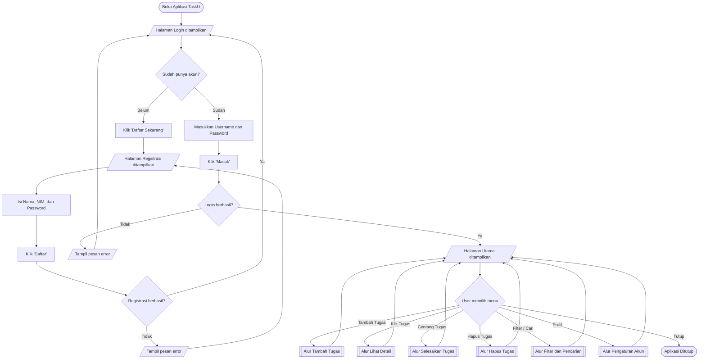
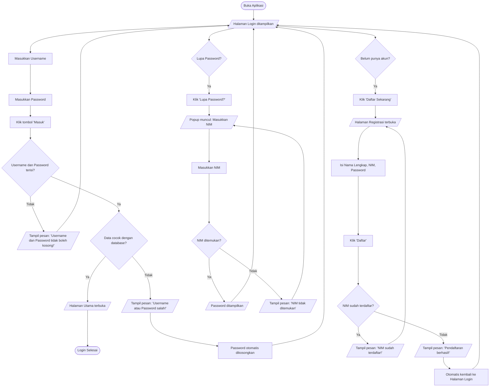
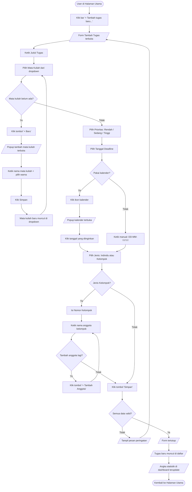
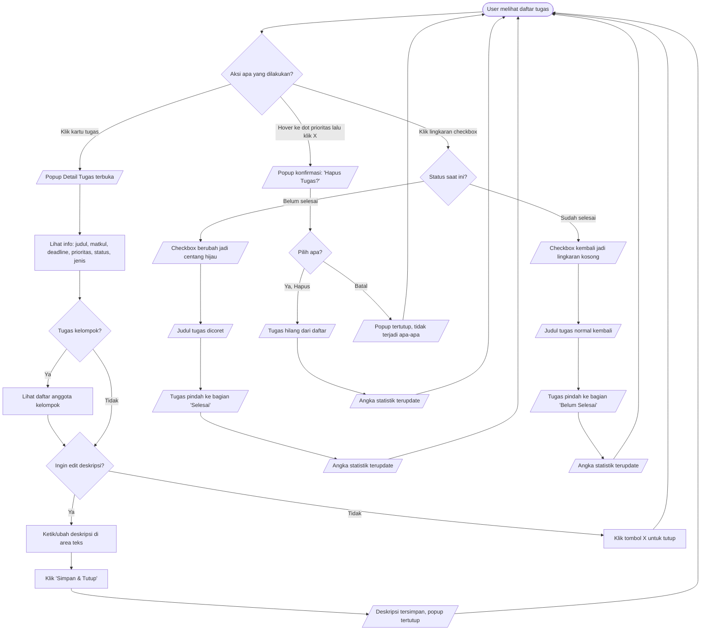
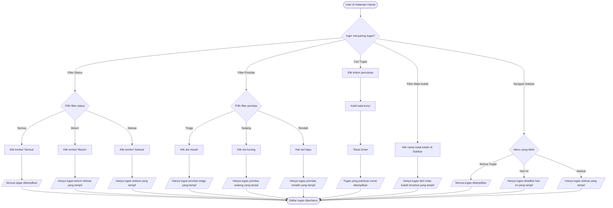
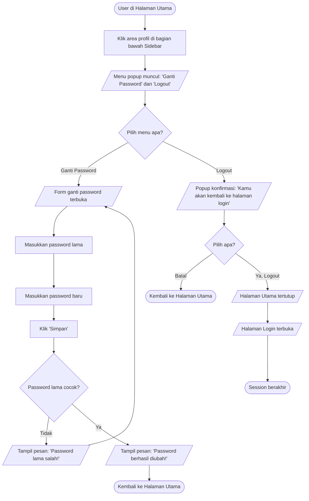

# 👤 Flowchart User — Aplikasi TaskU

> Flowchart ini menggambarkan alur aplikasi **dari sudut pandang pengguna (user)**.
> Tidak ada kode, SQL, atau nama method — hanya layar, aksi, dan hasil yang dilihat user.

---

## Perbedaan Flowchart Program vs Flowchart User

| | Flowchart Program (Sistem) | Flowchart User |
|---|---|---|
| **Sudut pandang** | Developer / Kode | Pengguna / User |
| **Isi** | SQL query, method, DAO, Service | Layar, tombol, form, pesan |
| **Contoh** | "DAO eksekusi INSERT ke database" | "Tugas baru muncul di daftar" |
| **Tujuan** | Memahami logika kode | Memahami alur penggunaan aplikasi |

---

## 1. Flowchart User — Alur Utama Keseluruhan

---

## 2. Flowchart User — Login dan Registrasi

---

## 3. Flowchart User — Tambah Tugas Baru

---

## 4. Flowchart User — Kelola Tugas (Detail, Selesai, Hapus)

---

## 5. Flowchart User — Filter dan Pencarian

---

## 6. Flowchart User — Pengaturan Akun (Profil)

